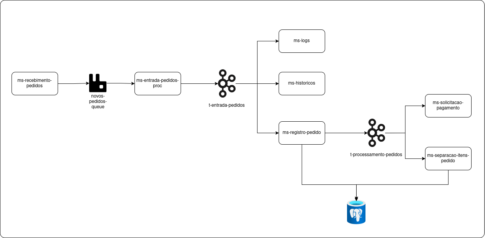

# Repositório Principal

## Estrutura 

- ms-recebimento-pedidos: ponto de entrada da aplicacao
- ms-entrada-pedidos-proc: processamento da fila de pedidos recebidos
- ms-historicos
- ms-logs
- ms-registro-pedido
- ms-solicitacao-pagamento
- ms-separacao-itens-pedido



## Subir a estrutura 

```bash
podman compose up
``` 

O **docker** pode ser usado, substituindo o nome do comando.

## Interfaces de operação

| Serviço | Porta | User | Senha |
| --- | --- | --- | --- |
| Kafka-UI | 9494 | admin | senha-admin |
| RabbitMQ | 15672 |  |  |